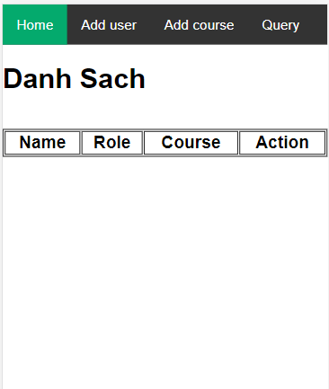
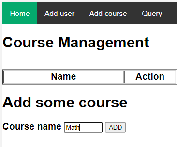
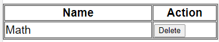
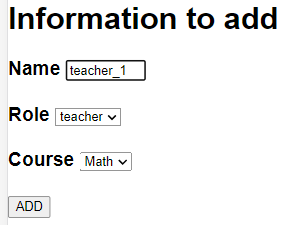

# Introduction
- This is a simple webapp about managing a school system.
# Simple workflow

## 1. Add a course
- First, we click at **Add course** on the menu tab, then input the course name. In this example, we will input a course named "Math". 

- After adding, the course will appear on the table. 

## 1. Add a student or teacher.
- We just can add a student or teacher in case there is at least one course added in the system.
- Let's go to the **Add user** tab to add some people to this course.
- First, let's add a teacher to the Math course. 

- Then, we add 2 student similarly.
## 2. Deploy on sever.
- Let's enjoy more on the website: [deployed model](https://simple-management-web-app.herokuapp.com/)

